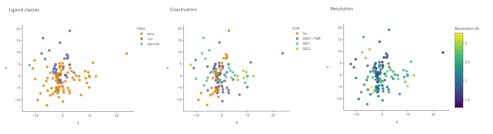

# Descriptors_package
This repository contains **Biodescriptors** python package. This tool provides the set of functions for calculating various geometrical descriptors for proteins given their structure as a PDB-file and outputting them in a form of a dataframe or CSV-table.

## Installation

To use this package, clone this repository and enter the following command from the location of this project

  `pip install . -r requirements.txt`

Several descriptors require DSSP module to be installed, this can be done using:

`sudo apt-get install dssp`

Additionally one may need KPAX software for providing user settings for protein helices borders: http://kpax.loria.fr/ 

The structure of the package and detailed description of each function could be found here: https://glukhovigor.github.io/Descriptors_package/biodescriptors.html

For developers - 

  `pip install -e . -r requirements_dev.txt`
  
## Usage

Our tool allows to analyse the structure of PDB files in terms of structural descriptors implemented.

For instance, using plotly, one can easily compare descriptor profiles of the given PDB structures with polar charts. Here you can see an example of comparison of the vitamin D receptor datasets for three different species - note the differences in the same descriptors for different species. Also for human, we can see the structure that can be considered as an outlier as its values are higher for majority of descriptors.

Another example is labeling the data according to the various components in a complex (coactivator, ligand) or to some property of a crystal structure such as resolution:

**Note!** The the data for abovementioned examples was normalized across each dataset separately! If we merge all the data together and normalize it within the whole dataframe we will obtain the following picture:

This means that the way of data normalization depends on the questions one wants to address: 

- separate normalization helps identifying patterns within each dataset and makes the scale the same for each dataset (e.g. that maximum value of some descriptor in each dataset will be the same reflecting that it is just a maximum value);
- normalization of merged data helps considering the properties of each dataset altogethes, so that we don't have the same maximum in each dataframe but they are sorted according to the their absolute values. This allows exploring the properties of the structures that are common between the datasets (such as coactivators or ligands present).

To get an example of usage of this package, see [`usage_example.ipynb`](usage_example.ipynb)

To get a code for these (and some more) examples of analysis that can be performed using the output of this package, see [`analysis_example.ipynb`](analysis_example.ipynb)

## Team
- Karina Pats, PhD student, ITMO University
- Igor Glukhov, MSc student, ITMO University
- Elisaveta Vinogradova, MSc student, ITMO University

## Acknowledgements
- Dr. Ferdinand Molnar, Associate Professor, Nazarbayev University
- Dr. Marie-Dominique Devignes, Lorraine Research Laboratory in Computer Science and its Applications, University of Lorraine
- Stepan Petrosyan, Bioinformatics Institute student (2019/2020)
- Maria Mamaeva, Bioinformatics Institute student (2019/2020)
